# FlowOps Service Operations Analytics Platform

An end-to-end Microsoft Fabric analytical data platform built around [FlowOps](https://github.com/edzarquiza/flow-ops), a deployed, tested IT service-desk operations application.

`Microsoft Fabric` · `Fabric Data Factory` · `Lakehouse` · `PySpark` · `Fabric Warehouse` · `Direct Lake` · `Power BI` · `PostgreSQL`

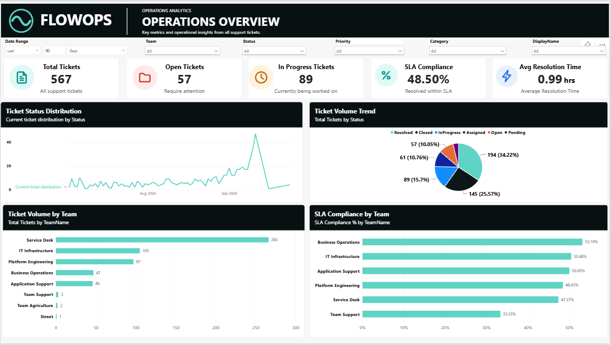

---

## What this project is

FlowOps is an operational application: it stores tickets, teams, SLAs, and delivery activity in PostgreSQL, and it's built to answer "what needs attention right now." That's a different question from "how has the team performed over the last quarter," and answering the second one well means taking FlowOps' operational data somewhere else — a platform built for analysis, not transactions.

```
FlowOps Application  →  PostgreSQL / Neon  →  Microsoft Fabric  →  Direct Lake Semantic Model  →  Power BI
   (operational)          (operational data)     (analytical platform)      (analytical layer)      (consumption)
```

This repository documents and presents that analytical platform: an incremental ingestion pipeline, a Bronze/Silver/Gold Lakehouse and Warehouse architecture, automated data-quality validation, a Direct Lake semantic model, and a three-page Power BI report — built around FlowOps' real operational schema, not a synthetic dataset built for the occasion.

**This is not a Power BI dashboard project.** Power BI is the last of eight stages data passes through. The platform that gets it there is the engineering story.

## Why this project

FlowOps already demonstrates full-stack product engineering — a modular monolith, a deterministic attention engine, 1,373 tests, a live deployment. This project demonstrates a different, complementary skill: taking an existing operational system's data and building a governed analytical platform around it — ingestion, validation, transformation, dimensional modeling, and semantic serving — the same lifecycle a real BI/data engineering role would ask for.

It's an applied implementation, not a Fabric tutorial: every component below was built, run, and evidenced against FlowOps' actual data, not a walkthrough dataset.

## Architecture

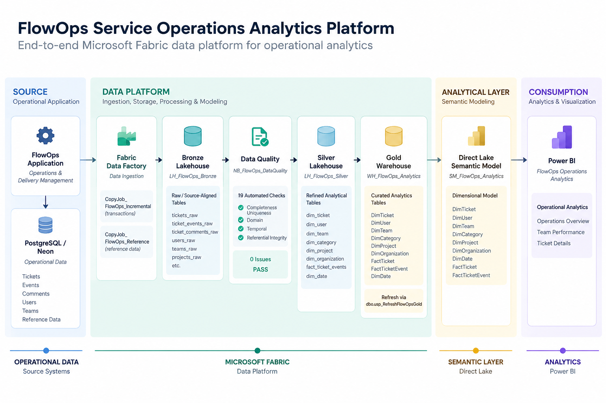

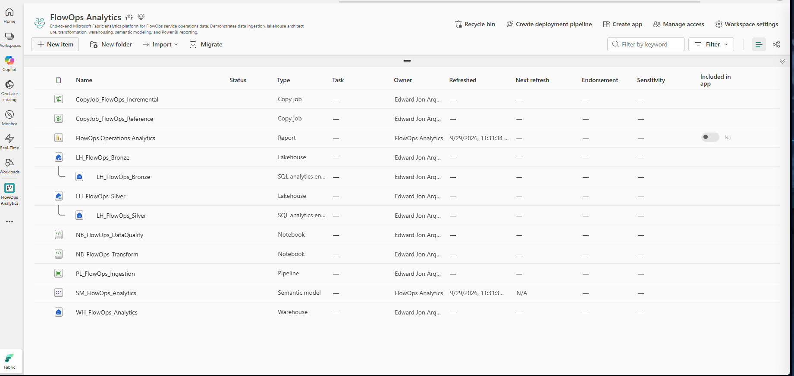
*The `FlowOps Analytics` Fabric workspace — the Copy Jobs, both Lakehouses, both Notebooks, the orchestration Pipeline, the Warehouse, the semantic model, and the Power BI report, all in one place.*

| Layer | Role in this project |
|---|---|
| **Source** | FlowOps' own operational PostgreSQL database (hosted on Neon) — the same data the live application reads and writes |
| **Data Platform** | Fabric Data Factory ingests it; two Lakehouses (Bronze, Silver) and a Warehouse (Gold) progressively refine it |
| **Analytical Layer** | A Direct Lake semantic model exposes the Gold Warehouse as reusable relationships and measures |
| **Consumption** | Power BI reports against the semantic model — never against raw PostgreSQL |

## Pipeline Flow

The Fabric pipeline `PL_FlowOps_Ingestion` orchestrates four stages, each gated on the previous one succeeding:

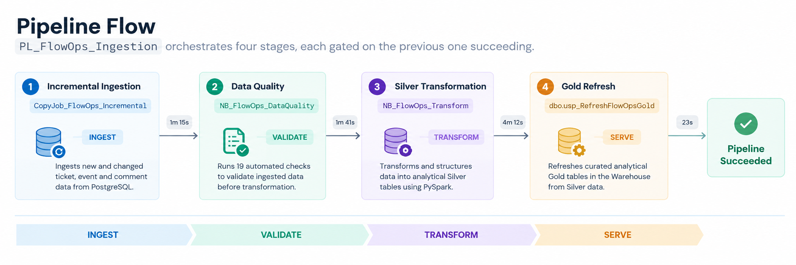

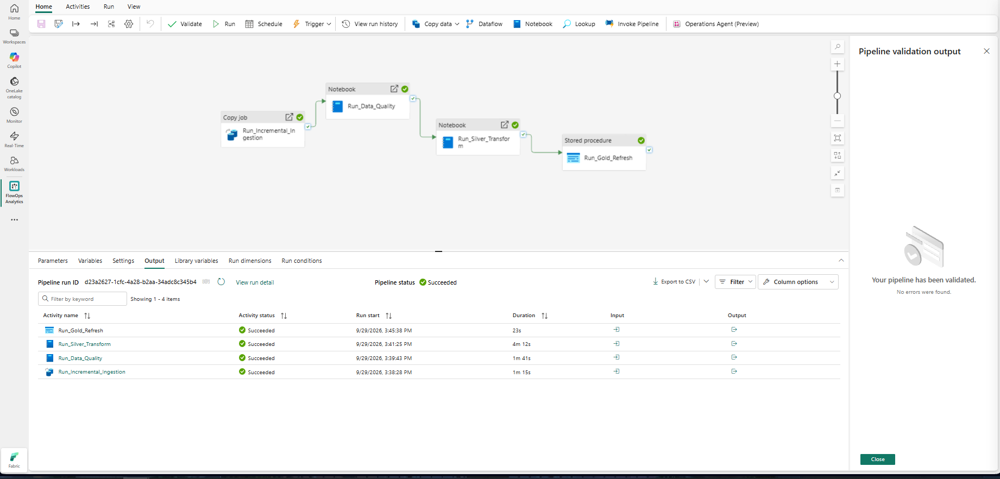
*A captured successful run of `PL_FlowOps_Ingestion` — all four activities succeeded, in sequence, in just under 7½ minutes.*

Those durations are what one successful run measured — not a benchmark, an SLA, or an average.

## Data Lifecycle

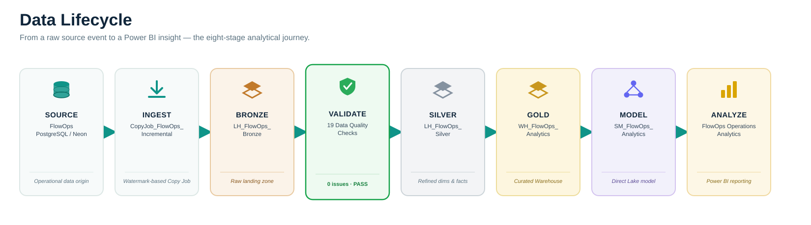

Every stage above maps to a real, named Fabric artifact — nothing here is a placeholder for a step that doesn't exist yet.

## Incremental Ingestion

FlowOps' transactional data (tickets, ticket events, ticket comments) changes continuously after creation — a ticket gets reassigned, a comment gets added, a status changes. Treating every pipeline run as a full reload would work, but it wouldn't reflect how the source actually behaves. `CopyJob_FlowOps_Incremental` instead uses watermark-based change detection:

| Table | Watermark | Merge Key | Write Method |
|---|---|---|---|
| `tickets` | `updated_at` | `id` | Merge |
| `ticket_events` | `id` | `id` | Merge |
| `ticket_comments` | `id` | `id` | Merge |

This was validated as a three-step test, not just configured and assumed to work:

```
Initial load               No-change run              Controlled update
635 tickets          →     0 tickets            →      1 ticket detected
3,382 ticket events         0 ticket events              4 ticket events detected
1,105 comments               0 comments                   → 3,386 ticket events after Silver/Gold refresh
```

That's **incremental batch ingestion** — not real-time or streaming. The point of the test was proving the pipeline reacts correctly to a real change, not proving throughput at scale.

## Bronze → Silver → Gold

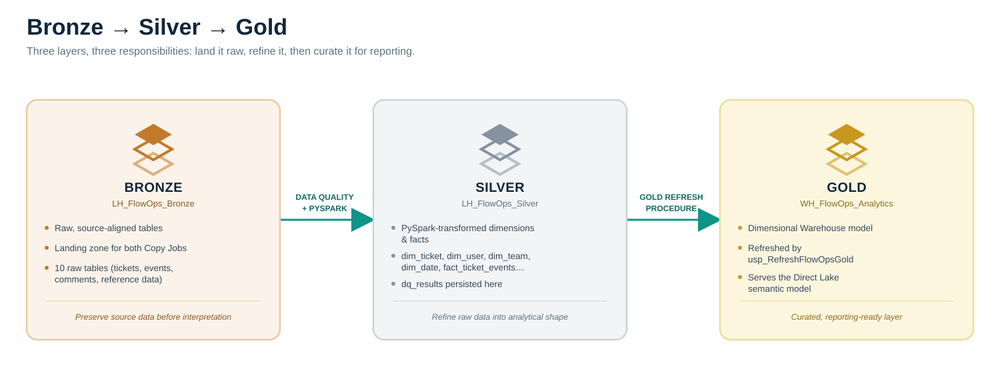

- **Bronze** (`LH_FlowOps_Bronze`) lands data close to its source shape, before any interpretation is applied.
- **Silver** (`LH_FlowOps_Silver`) is where `NB_FlowOps_Transform` (PySpark) reshapes it into dimension/fact tables — `dim_ticket`, `dim_user`, `dim_team`, `dim_category`, `dim_project`, `dim_organization`, `dim_date`, `fact_ticket_events`.
- **Gold** (`WH_FlowOps_Analytics`) is the curated Warehouse `dbo.usp_RefreshFlowOpsGold` populates from Silver — the dimensional model Power BI actually queries through.

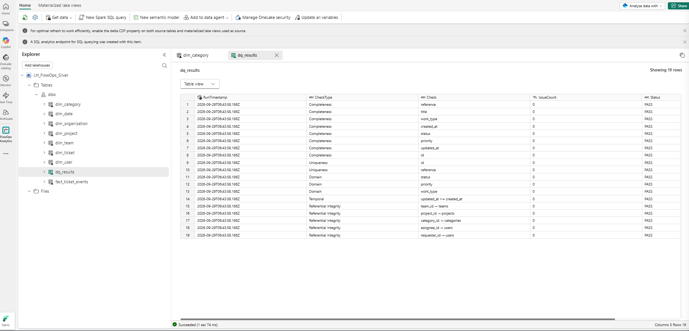
*`LH_FlowOps_Silver`'s table explorer — the dimension/fact tables produced by `NB_FlowOps_Transform`, plus `dq_results`, the persisted output of the Data Quality stage.*

## Data Quality

Validation runs *before* the data is allowed to reach Silver, not after — a real engineering control, not an afterthought:

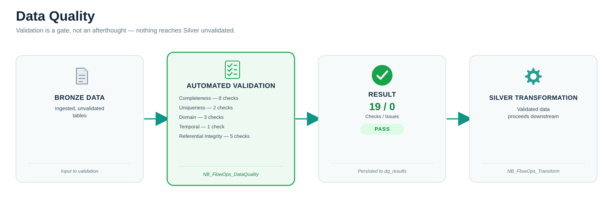

| Category | Checks | Covers |
|---|---:|---|
| Completeness | 8 | Required ticket fields are populated |
| Uniqueness | 2 | Ticket ID, ticket reference |
| Domain | 3 | Valid status, priority, work type |
| Temporal | 1 | `updated_at >= created_at` |
| Referential Integrity | 5 | `team_id`, `project_id`, `category_id`, `assignee_id`, `requester_id` all resolve |

Current verified result: **19 checks, 0 issues, PASS** — persisted to `LH_FlowOps_Silver.dbo.dq_results` (visible in the Silver Lakehouse screenshot above), not just printed to a notebook cell and discarded.

## Data Model

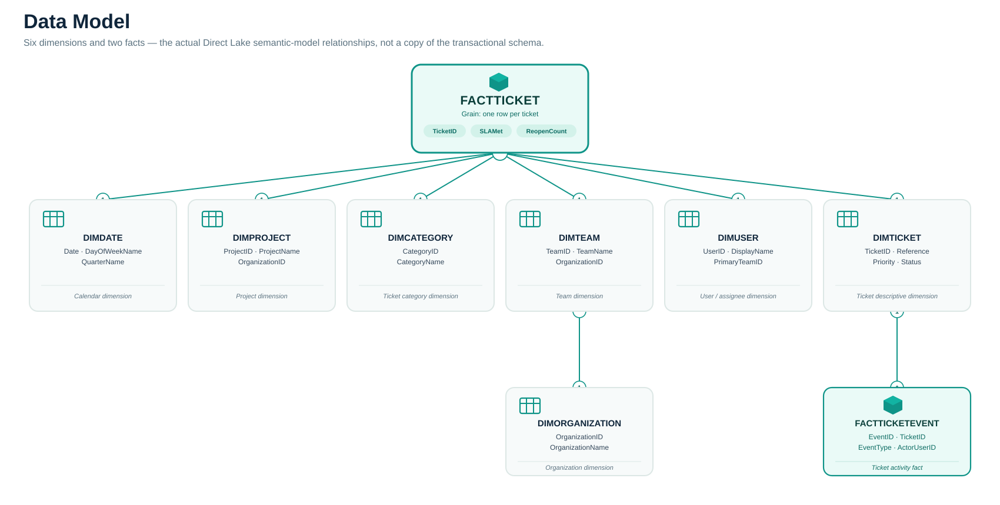

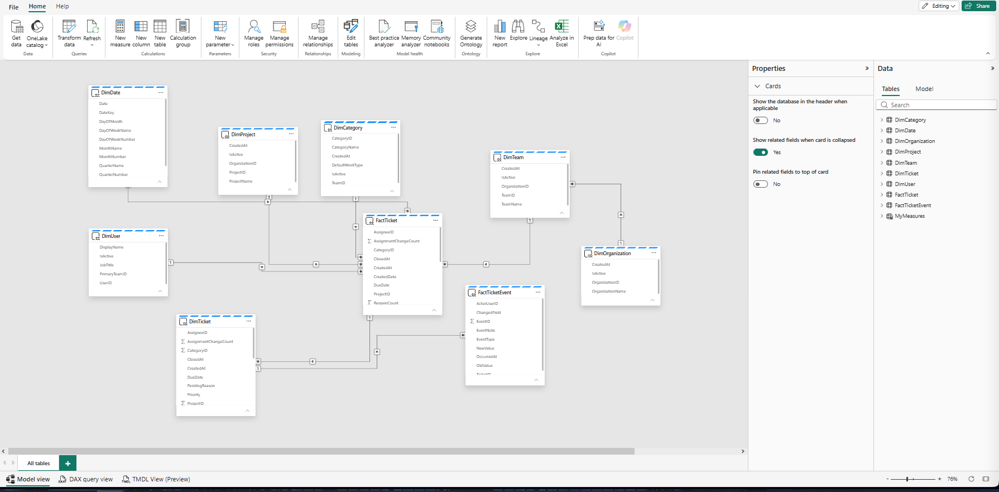
*`SM_FlowOps_Analytics` in Model view — the actual relationships behind the diagram above, not a simplified stand-in for it.*

The Gold Warehouse deliberately isn't a copy of the PostgreSQL transactional schema — it separates **dimensions** (`DimDate`, `DimUser`, `DimTeam`, `DimCategory`, `DimProject`, `DimOrganization`, `DimTicket`) from **facts** (`FactTicket`, `FactTicketEvent`), the shape a semantic model and Power BI are actually built to consume.

## Semantic Model & Measures

`SM_FlowOps_Analytics` runs in **Direct Lake on OneLake** — Power BI queries the Gold Warehouse's parquet files directly through the semantic layer, without a separate import/refresh copy of the data. The model carries reusable DAX measures so report authors work with named business concepts instead of one-off visual-level calculations: `Total Tickets`, `Open Tickets`, `SLA Compliance %`, `Overdue Tickets`, `Reopen Rate %`, `Average Resolution Hours`, `Assignment Changes`, `Average Events per Ticket`, and others spanning ticket volume, SLA, resolution, reopen, and workload analysis.

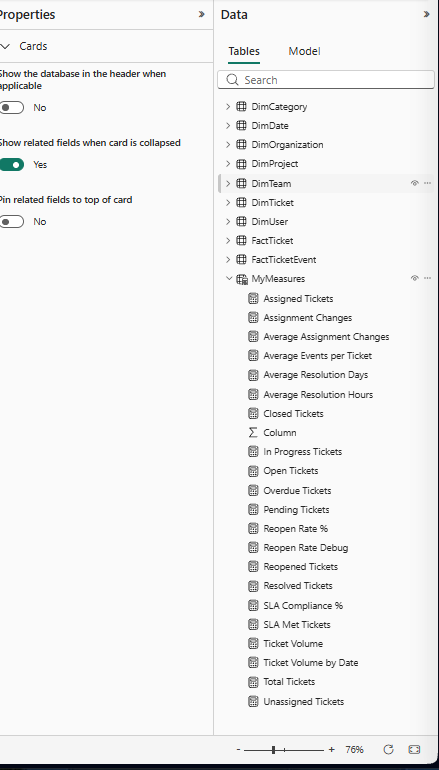
*The semantic model's measure list, grouped for ticket volume, SLA, resolution, reopen, and workload analysis.*

## Power BI Analytics

`FlowOps Operations Analytics` is the final consumption layer — three pages, each answering a different operational question, all built against the semantic model rather than a direct PostgreSQL connection.

### Operations Overview — *"What's the overall state of the queue?"*


High-level ticket volume, status distribution, SLA compliance, and team-by-team comparison, filterable by date range, team, status, priority, and category. (Shown here filtered to the last 90 days — the underlying Gold/Silver tables hold the full 635-ticket dataset described below.)

### Team Performance — *"Where is operational pressure concentrated?"*

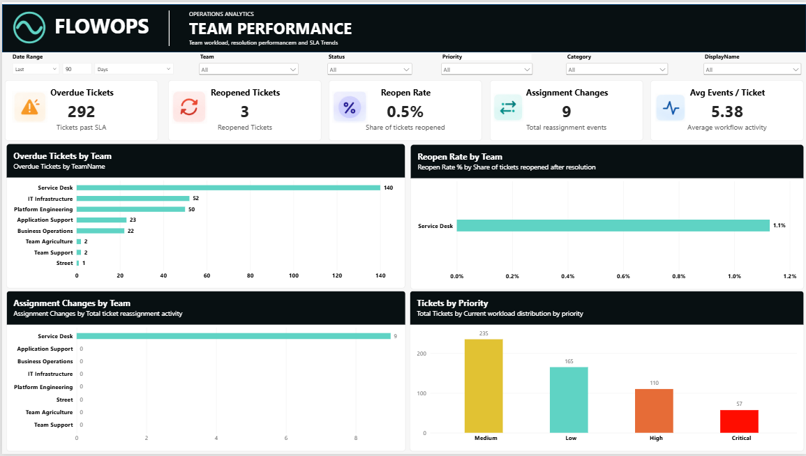

Overdue work, reopen activity, assignment changes, and priority distribution, broken down by team — the view a team lead would use to see where load and risk are building up.

### Ticket Details — *"What does the work actually look like, ticket by ticket?"*

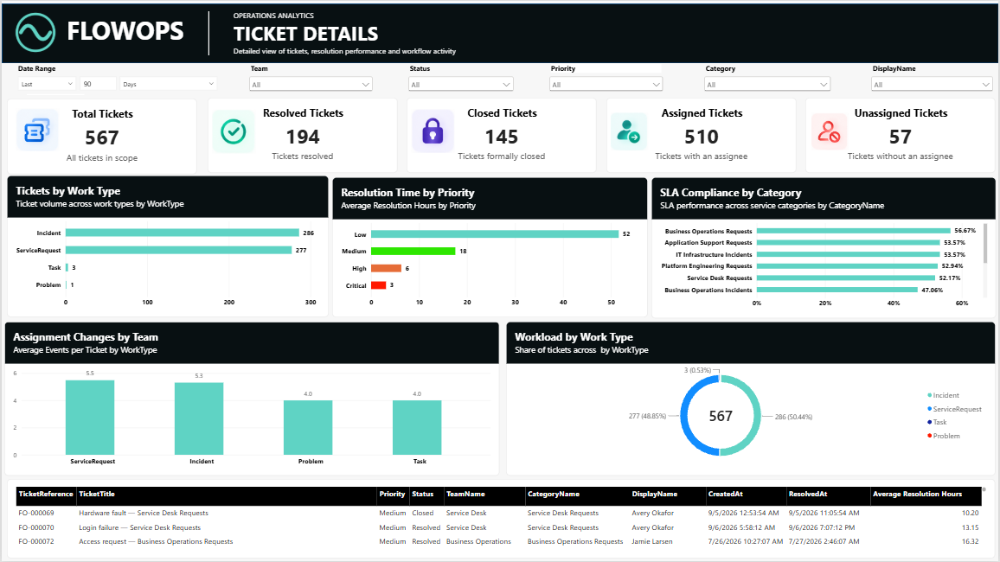

Granular analysis by work type, resolution time, SLA compliance by category, and assignment activity, plus a detail table for drilling into individual tickets.

## Technology Stack

| Technology | Role |
|---|---|
| PostgreSQL / Neon | Operational data source (FlowOps' own database) |
| Microsoft Fabric Data Factory | Data ingestion & orchestration (Copy Jobs, Pipeline) |
| Fabric Lakehouse | Bronze and Silver storage |
| PySpark / Spark Notebooks | Bronze validation and Silver transformation |
| Fabric Warehouse | Gold analytical storage |
| T-SQL / Stored Procedure | Gold refresh (`usp_RefreshFlowOpsGold`) |
| Direct Lake | Semantic model storage mode |
| Power BI | Analytics and visualization |
| DAX | Analytical measures |

## Validation & Results

| Area | Result |
|---|---|
| Data Quality | 19 automated checks, 0 issues, **PASS** |
| Pipeline | All 4 orchestrated activities succeeded end-to-end |
| Incremental ingestion | Initial load → no-change validation → controlled-update validation, all behaving as designed |

Current verified analytical dataset (Silver/Gold, current as of this pipeline run — will change as FlowOps' source data changes):

| Entity | Rows |
|---|---:|
| Tickets | 635 |
| Ticket events | 3,386 |
| Users | 32 |
| Teams | 8 |
| Categories | 13 |
| Projects | 11 |
| Organizations | 6 |
| Dates | 104 |

## Engineering Decisions

| Decision | Reason |
|---|---|
| Incremental ingestion over full reload | FlowOps' ticket data keeps changing after creation (status, assignment, comments) — watermarking reflects that instead of pretending the source is static |
| Bronze / Silver / Gold separation | Keeps "what we ingested" (Bronze), "what we transformed" (Silver), and "what we serve" (Gold) as distinct, independently reasoned-about stages |
| Data Quality runs before Silver, not after | Catching structural/referential problems before they propagate into analytical tables is cheaper than catching them in a Power BI visual |
| Gold served from a Fabric Warehouse | Gives the semantic model a stable, dimensional, T-SQL-queryable surface rather than modeling directly against Lakehouse files |
| Direct Lake for the semantic model | Power BI reads the Warehouse's OneLake data directly — no separate import/refresh copy of the analytical data to keep in sync |

## Future Enhancements

Ideas below are explicitly **not implemented** — they're future scope, not part of the current platform:

- Richer, historical Data Quality trend reporting (the current implementation validates each run but doesn't retain run-over-run history)
- Additional analytical dimensions (e.g. SLA configuration history, sprint/backlog analytics)
- Expanded Fabric governance (sensitivity labels, deployment pipelines)
- Deployment/CI automation for the Fabric artifacts themselves

AI-assisted ticket intelligence is a natural next idea for this kind of platform, but it is **not implemented** here and shouldn't be read as a claim about the current build.

## Project Structure

```
Flow_Ops_Fabric/
├── README.md                              — this file
├── CLAUDE.md                              — Claude Code operating context for this repo
├── docs/
│   └── fabric/
│       ├── FABRIC_PROJECT_CONTEXT.md      — full implementation reference (exact object names, row counts, screenshot inventory)
│       └── diagrams/                       — every diagram used in this README
│           ├── architecture-diagram.png
│           ├── pipeline-flow-diagram.png
│           ├── data-lifecycle-diagram.svg
│           ├── bronze-silver-gold-diagram.svg
│           ├── data-quality-diagram.svg
│           └── data-model-diagram.svg
└── FlowOps_Fabric_Screenshots/            — the actual Fabric/Power BI screenshots used as evidence throughout this README
```

## Related Project

FlowOps — the operational application this platform is built around — is a separate, deployed project: a modular-monolith ASP.NET Core service-desk platform with a deterministic attention engine, 1,373 tests, and a live deployment.

- [FlowOps — Source on GitHub](https://github.com/edzarquiza/flow-ops)
- [FlowOps — Live Demo](https://flow-ops.onrender.com)
- [FlowOps — Architecture Docs](https://github.com/edzarquiza/flow-ops/blob/main/docs/architecture.md)

## Documentation

- [Fabric implementation reference](docs/fabric/FABRIC_PROJECT_CONTEXT.md) — exact Fabric object names, verified row counts, screenshot-by-screenshot evidence inventory, and open items still pending confirmation
